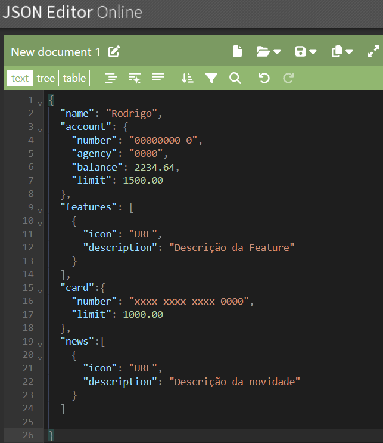
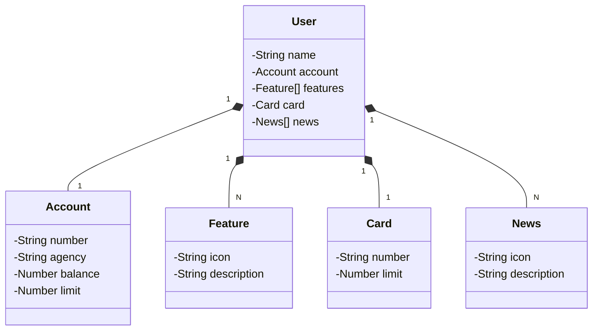

# java RESTful API 
## Json

Criada a entidade usuário, a Lista de Features, a entidade cartão e a lista de novidades.

em seguida joguei o json no chatGPT e pedi para  gerar a diagramação de classes na sintaxe MERMAID.

## Diagrama de classes



## MAPEAMENTO  OBJETO RELACIONAL (ORM):
 Transfomando cada entidade em uma tabela no banco de dados. (@Entity, @Id, @GeneratedValues, @Table, @OneToOne, @OneToMany, @ManyToOne, e @ManyToMany)

##  Informações adicionais. @Entity()

O `@Entity` em Java é uma anotação usada no contexto da Java Persistence API (JPA), que é uma especificação para gerenciamento de dados relacionais em aplicativos Java. Quando você anota uma classe com `@Entity`, você está declarando que essa classe é uma entidade JPA. Uma entidade é um objeto leve e persistente que representa uma tabela no banco de dados. Cada instância dessa classe corresponde a uma linha na tabela.

Aqui estão alguns pontos principais sobre o `@Entity`:

1. **Mapeamento de Tabela**:
   - Quando uma classe é anotada com `@Entity`, o JPA mapeia essa classe para uma tabela do banco de dados. O nome da tabela, por padrão, é o mesmo nome da classe, mas pode ser personalizado com a anotação `@Table`.

2. **Chave Primária**:
   - Toda entidade JPA deve ter uma chave primária, que é anotada com `@Id`. A chave primária é usada para identificar de forma única cada instância da entidade.

3. **Mapeamento de Campos**:
   - Os campos ou propriedades da entidade são mapeados para as colunas da tabela do banco de dados. Por padrão, cada campo é mapeado para uma coluna com o mesmo nome, mas isso pode ser configurado usando a anotação `@Column`.

4. **Relacionamentos**:
   - Entidades podem ter relacionamentos uns com os outros, como um-para-um, um-para-muitos, muitos-para-um, e muitos-para-muitos. Esses relacionamentos são definidos usando anotações como `@OneToOne`, `@OneToMany`, `@ManyToOne`, e `@ManyToMany`.

Aqui está um exemplo básico de uma entidade JPA:

```java
import javax.persistence.Entity;
import javax.persistence.Id;
import javax.persistence.GeneratedValue;
import javax.persistence.GenerationType;
import javax.persistence.Table;
import javax.persistence.Column;

@Entity
@Table(name = "users")
public class User {

    @Id
    @GeneratedValue(strategy = GenerationType.IDENTITY)
    private Long id;

    @Column(name = "name", nullable = false)
    private String name;

    @Column(name = "email", nullable = false, unique = true)
    private String email;

    // Getters and setters
}
```

Neste exemplo:

- A classe `User` é anotada com `@Entity`, indicando que é uma entidade JPA.
- A anotação `@Table` é usada para especificar o nome da tabela (`users`) no banco de dados.
- O campo `id` é anotado com `@Id` para indicar que é a chave primária. A anotação `@GeneratedValue` é usada para especificar a estratégia de geração de valores para a chave primária.
- Os campos `name` e `email` são mapeados para colunas na tabela. A anotação `@Column` é usada para personalizar o mapeamento da coluna, como definir que a coluna `email` deve ser única.

## Informações adicionais. @Id e @GeneratedValue

A anotação `@Id` em Java é usada no contexto da Java Persistence API (JPA) para especificar a chave primária de uma entidade. A chave primária é um campo ou propriedade de uma entidade que é utilizado para identificar de forma única cada instância dessa entidade no banco de dados.

Aqui estão alguns pontos importantes sobre a anotação `@Id`:

1. **Identificação Única**:
   - O campo anotado com `@Id` será utilizado pelo JPA para identificar unicamente cada instância da entidade. Esse campo geralmente corresponde à coluna da chave primária na tabela do banco de dados.

2. **Geração de Valores**:
   - Frequentemente, o campo anotado com `@Id` é combinado com a anotação `@GeneratedValue` para indicar que o valor da chave primária deve ser gerado automaticamente pelo provedor JPA ou pelo banco de dados. A anotação `@GeneratedValue` pode aceitar diferentes estratégias de geração de valor, como `AUTO`, `IDENTITY`, `SEQUENCE`, e `TABLE`.

3. **Tipo do Campo**:
   - O tipo do campo anotado com `@Id` pode variar, mas geralmente é um tipo numérico como `Long` ou `Integer`. No entanto, outros tipos, como `UUID` ou `String`, também podem ser usados, dependendo da estratégia de geração de chave primária e dos requisitos do banco de dados.

Aqui está um exemplo simples de uma entidade JPA com a anotação `@Id`:

```java
import javax.persistence.Entity;
import javax.persistence.Id;
import javax.persistence.GeneratedValue;
import javax.persistence.GenerationType;

@Entity
public class User {

    @Id
    @GeneratedValue(strategy = GenerationType.IDENTITY)
    private Long id;

    private String name;

    private String email;

    // Getters and setters
}
```

Neste exemplo:

- A classe `User` é uma entidade JPA, indicada pela anotação `@Entity`.
- O campo `id` é anotado com `@Id`, indicando que é a chave primária da entidade.
- A anotação `@GeneratedValue(strategy = GenerationType.IDENTITY)` é usada para especificar que o valor do campo `id` deve ser gerado automaticamente pelo banco de dados, usando a estratégia de identidade (`IDENTITY`).

Ao usar `@Id` e `@GeneratedValue`, você permite que o provedor JPA gerencie a geração e a atribuição de valores únicos para a chave primária, simplificando o processo de persistência de dados no banco de dados.

## Informações adicionais. Relacionamento entre entidades(@OneToOne, @OneToMany)

### O `@OneToOne`
 em Java é uma anotação usada na JPA (Java Persistence API) para definir um relacionamento um-para-um entre duas entidades. Isso significa que cada instância de uma entidade está associada a uma instância única de outra entidade.

Por exemplo, suponha que você tenha duas entidades, `Pessoa` e `Passaporte`, onde cada pessoa possui exatamente um passaporte, e cada passaporte pertence exatamente a uma pessoa. Você poderia modelar isso usando o `@OneToOne`.

Aqui está um exemplo básico de como isso pode ser feito:

```java
import javax.persistence.*;

@Entity
public class Pessoa {
    @Id
    @GeneratedValue(strategy = GenerationType.IDENTITY)
    private Long id;
    
    private String nome;
    
    @OneToOne(mappedBy = "pessoa", cascade = CascadeType.ALL)
    private Passaporte passaporte;

    // getters e setters
}

@Entity
public class Passaporte {
    @Id
    @GeneratedValue(strategy = GenerationType.IDENTITY)
    private Long id;
    
    private String numero;
    
    @OneToOne
    @JoinColumn(name = "pessoa_id")
    private Pessoa pessoa;

    // getters e setters
}
```

Neste exemplo:

- A classe `Pessoa` tem um campo `passaporte` anotado com `@OneToOne`, indicando o relacionamento um-para-um.
- A propriedade `mappedBy` em `Pessoa` indica que o campo `passaporte` é o lado inverso do relacionamento e é mapeado pelo campo `pessoa` em `Passaporte`.
- A classe `Passaporte` tem um campo `pessoa` anotado com `@OneToOne` e `@JoinColumn`, que define a coluna de chave estrangeira que mantém o relacionamento.

Ao usar o `CascadeType.ALL`, qualquer operação realizada em uma instância de `Pessoa` (como persistir, atualizar ou remover) será automaticamente propagada para a instância relacionada de `Passaporte`.

### O `@OneToMany` 
em Java é uma anotação usada na JPA (Java Persistence API) para definir um relacionamento um-para-muitos entre duas entidades. Isso significa que uma instância de uma entidade está associada a várias instâncias de outra entidade.

Por exemplo, suponha que você tenha duas entidades, `Departamento` e `Funcionario`, onde um departamento pode ter vários funcionários, mas cada funcionário pertence a um único departamento. Você poderia modelar isso usando o `@OneToMany`.

Aqui está um exemplo básico de como isso pode ser feito:

```java
import javax.persistence.*;
import java.util.List;

@Entity
public class Departamento {
    @Id
    @GeneratedValue(strategy = GenerationType.IDENTITY)
    private Long id;
    
    private String nome;
    
    @OneToMany(mappedBy = "departamento", cascade = CascadeType.ALL)
    private List<Funcionario> funcionarios;

    // getters e setters
}

@Entity
public class Funcionario {
    @Id
    @GeneratedValue(strategy = GenerationType.IDENTITY)
    private Long id;
    
    private String nome;
    
    @ManyToOne
    @JoinColumn(name = "departamento_id")
    private Departamento departamento;

    // getters e setters
}
```

Neste exemplo:

- A classe `Departamento` tem um campo `funcionarios` anotado com `@OneToMany`, indicando o relacionamento um-para-muitos. A propriedade `mappedBy` indica que este é o lado inverso do relacionamento e é mapeado pelo campo `departamento` em `Funcionario`.
- A classe `Funcionario` tem um campo `departamento` anotado com `@ManyToOne` e `@JoinColumn`, que define a coluna de chave estrangeira que mantém o relacionamento.
- O uso de `CascadeType.ALL` em `Departamento` garante que operações realizadas em uma instância de `Departamento` (como persistir, atualizar ou remover) sejam automaticamente propagadas para as instâncias relacionadas de `Funcionario`.

Com essa configuração, você pode adicionar funcionários a um departamento e JPA cuidará de manter o relacionamento correto no banco de dados.

## Informações adicionais: `@MappedSuperclass`

 é uma anotação em Java usada na JPA (Java Persistence API) para designar uma classe cujas propriedades são herdadas por entidades, mas a própria classe não será mapeada para uma tabela no banco de dados. Em outras palavras, uma classe anotada com `@MappedSuperclass` serve como uma classe base que define propriedades comuns para outras entidades, mas não é uma entidade persistente por si só.

Aqui está um exemplo de como usar `@MappedSuperclass`:

```java
import javax.persistence.*;

@MappedSuperclass
public abstract class BaseEntity {
    @Id
    @GeneratedValue(strategy = GenerationType.IDENTITY)
    private Long id;
    
    private String createdBy;
    private String updatedBy;

    // getters e setters
}

@Entity
public class Usuario extends BaseEntity {
    private String nome;
    private String email;

    // getters e setters
}

@Entity
public class Produto extends BaseEntity {
    private String nome;
    private double preco;

    // getters e setters
}
```

Neste exemplo:

- A classe `BaseEntity` é anotada com `@MappedSuperclass`, indicando que suas propriedades (`id`, `createdBy`, `updatedBy`) serão herdadas por suas subclasses, mas `BaseEntity` não será mapeada para uma tabela no banco de dados.
- As classes `Usuario` e `Produto` são entidades que herdam de `BaseEntity`. Ambas terão as propriedades `id`, `createdBy` e `updatedBy`, além de suas próprias propriedades (`nome` e `email` para `Usuario`, `nome` e `preco` para `Produto`).
- `Usuario` e `Produto` serão mapeadas para tabelas no banco de dados e terão colunas correspondentes às propriedades herdadas de `BaseEntity`.

Usar `@MappedSuperclass` é útil quando você tem propriedades comuns que deseja compartilhar entre várias entidades sem duplicar o código em cada uma delas.