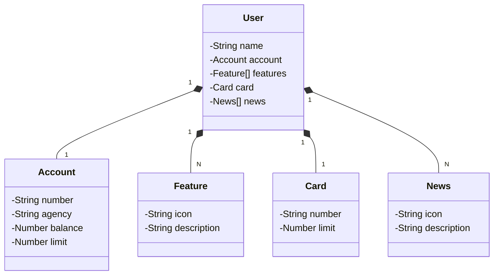

# java RESTful API 
## Json

Criada a entidade usuário, a Lista de Features, a entidade cartão e a lista de novidades.

em seguida joguei o json no chatGPT e pedi para  gerar a diagramação de classes na sintaxe MERMAID.

## Diagrama de classes

